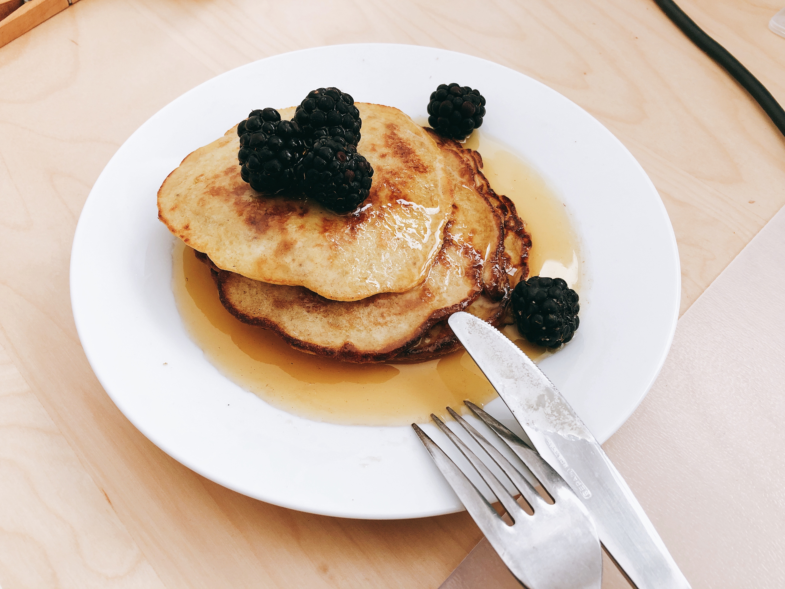

# Banana Pancakes

## ingredients

- banana `1 piece`
- flour `2 tbsp`
- egg `1 piece`
- butter

## instructions

### mixture

- In a bowl, mash the `banana`
- Add `flour` and `egg`
- Mix until everything is thoroughly combined

### pancakes

- In a pan, add some `butter` on medium heat
- When pan is hot, repeat 3 times:
	- Ladle 1/3 of the mixture into the pan
	- Wait until the bubbles that form around the mixture dies down
	- Flip the pancake
	- Cook for another 3 minutes
	- Take pancake out

## variants

- Serve with maple syrup and berries