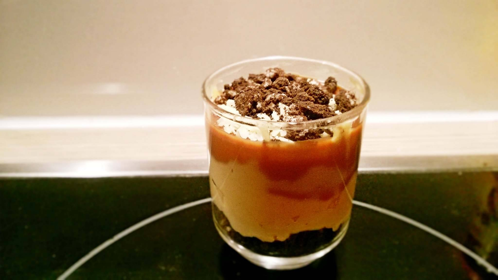

# Chocolate Peanut Butter Dessert

## ingredients

- oreos `8 pieces`
- heavy cream `100g + 2 tbsp`
- mascarpone `125g`
- peanut butter `2 tbsp`
- chocolate `150g`
- sugar && salt

## instructions

### init

- Turn `oreos` into fine crumbs
- Chop `chocolate` into pieces

### peanut butter cream

- In a bowl, combine `mascarpone` and `peanut butter` with `2 tbsp` of `heavy cream`
- Add `sugar` and `salt` as needed

### chocolate cream

- In a pan, cook `heavy cream` until it's bubbling
- Remove pan from heat
- Add `chocolate` pieces
- Wait one minute
- Add a pinch of `salt`
- Stir mix until smooth

### dessert

- Repeat until you run out of ingredients (or glasses):
	- In a glass, add some `oreo` crumbs
	- Add some peanut butter cream
	- Add some chocolate cream
	- Garnish with some `oreo` crumbs

## variants

- Garnish with almond slivers & `oreo` crumbs
- Garnish with chopped hazelnuts
- Garnish with chopped white chocolate