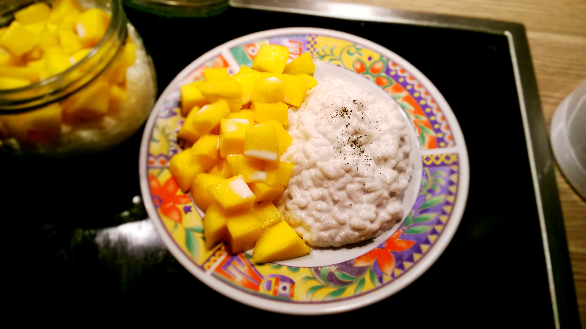

# Coconut Milk Rice Pudding

## ingredients

- coconut milk `400ml`
- water `400ml`
- butter
- Arborio rice `1/2 cup`
- sugar `1 tbsp`
- salt `1 pinch`
- diced mango

## instructions

### milk

- In a pot, combine `coconut milk` and `water`
- Bring the milk to a simmer
- Reduce heat to low

### rice pudding

- Melt butter in a pan on medium heat
- Stir in the `Arborio rice` and cook for 1 minute
- Repeat until you run out of milk:
	- Ladle some milk into the pan
	- Wait until the rice absorbs most of it while stirring
- Stir until the rice is tender
- Stir in sugar and salt

### composition

- Cool rice pudding to room temperature
- Refrigerate until well-chilled
- Garnish with `diced mango`

## variants

* Add nata de coco as garnish
* Substitute sugar with coconut sirup