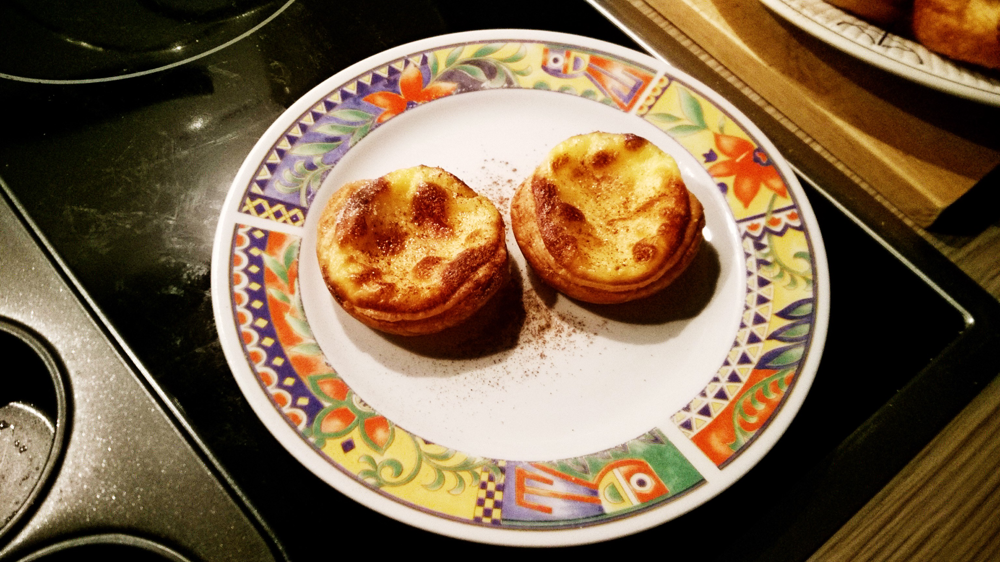

# Egg Tart

## ingredients

- puff pastry
- salt `1 pinch`
- sugar `6 tbsp`
- milk `250ml`
- eggs `2 pieces`
- starch `1 tbsp`

## instructions

### custard

- In a bowl, scramble the `eggs`
- Add `3 tbsp` of `sugar` and the `starch`
- Mix until egg mixture is smooth
- In a pot, add `milk`, a pinch of `salt`, and `3 tbsp` of `sugar`
- Stir continuously and bring to boil
- Gradually add the hot milk into the egg mixture while stirring
- Transfer mixture into the pot and cook on low heat
- Stir continuously and cook until the custard is thick
- Pass the custard through a sieve

### composition

- Preheat oven to 250°C
- Prepare muffin tin
- Repeat until muffin tin is full:
	- Cut a circle from the `puff pastry` sheet, roughly of the diameter of a muffin mold
	- With your hands, gently press to slightly enlarge the dough circle
	- Press dough circle inside muffin mold and press/pull the dough until the walls are covered with dough
	- Pour `custard` into dough shell 70% full
- Bake for 15 minutes

## variants

- Serve with some cinnamon and powdered sugar
- Use some vanilla extract to the custard
