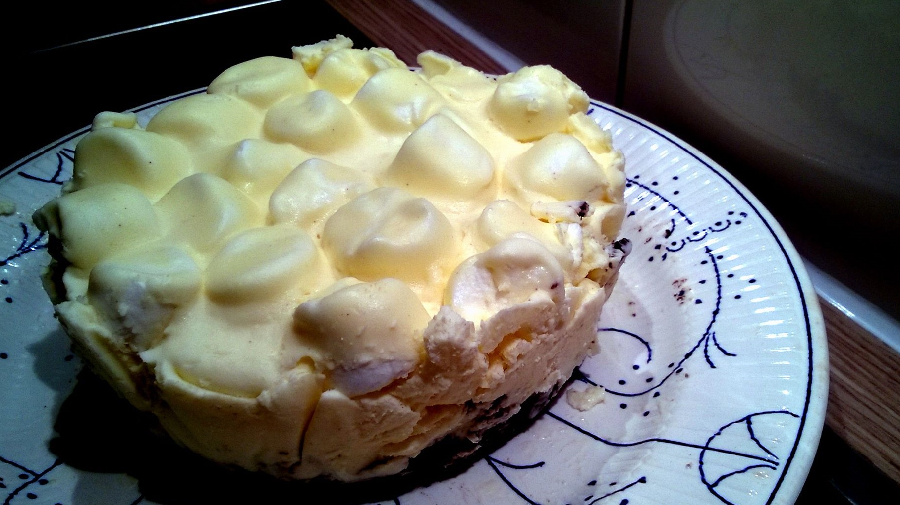

# Oreo Marshmallow Cheesecake

## ingredients

- butter `70g`
- oreos `16 pieces`
- double cream `150ml`
- cream cheese `250g`
- vanilla ice cream `45g`
- marshmallows

## instructions

for a `7cm` radius cake

### base

- Turn `oreos` into fine crumbs
- Melt `butter`
- Mix `butter` with `oreo` crumbs
- Press the mix into the bottom of your cake pan
- Place in the fridge

### filling

- Whip `double cream`
- Melt `vanilla ice cream`
- Mix `vanilla ice cream` with `cream cheese`
- Fold mix with the whipped `double cream`
- Put as many `marshmallows` in the mix as you see fit

### cake

- Get cake pan out of the fridge and spread filling over the base
- Refrigerate overnight

## variants

- Substitute `vanilla ice cream` with an ice cream flavor of your choice
- Garnish with left over `oreo` cookie crumbs, cocoa powder, or grate some chocolate
