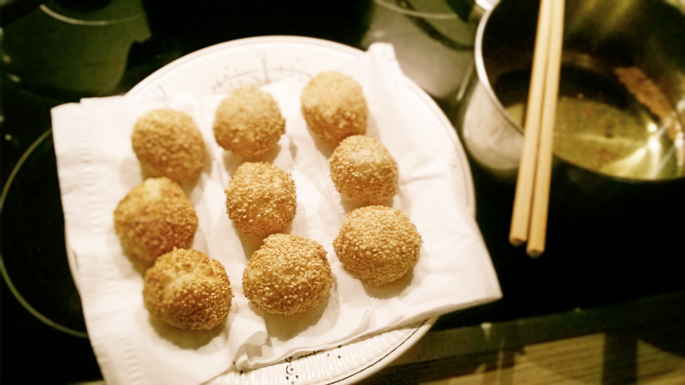

# Puff Pastry Sesame Balls

## ingredients

- azuki beans `1/2 cup`
- salt `1 pinch`
- sugar `3 tbsp`
- puff pastry
- sesame seeds
- oil

## instructions

### init

- Rinse `azuki beans`
- Soak `azuki beans` in water overnight
- Drain
- Prepare a dish of water and a dish of `sesame seeds`

### red bean paste

- In a pot, add `azuki beans` and water to cover the beans
- Bring to a boil
- Drain
- Add water to the pot with the beans until the water is 3cm above the beans
- Bring to a boil
- Turn down the heat and simmer for 1.5 hours
- When the beans are mushy, mash them with a fork
- Pass the beans through a sieve so that you get a smooth paste
- In a pot, add the paste, `salt`, and `sugar` on low heat
- Stir until combined and the mixture is thick

### filling

- After the paste has cooled down to room temperature, refridgerate for 1 hour
- Roll the paste into the form of a thick stick
- Divide the paste into 9 equal pieces and mold each one into a ball
- Put the balls in the freezer until they're frozen

### balls

- Roll out the `puff pastry` sheet and cut into 9 squares
- Get the filling balls out of the freezer
- Do 9 times:
	- On a puff pastry square, put a filling ball in the center
	- Fold and flatten the dough lightly to seal the edges
	- Dip the ball into the water dish to cover it with water
	- Dip the ball into the `sesame seeds` dish to cover it with `sesame seeds`

### frying

- In a pot, add enough `oil` so that a ball can be submerged in it
- Heat oil until you stand a wooden chopstick in the center and see bubbles appear steadily around it
- Deep fry the balls, two at a time, until they're golden brown
- Let them rest on some paper towel and cool down

## variants

- Use mung beans instead of `azuki beans`
- Use kidney beans instead of `azuki beans`
