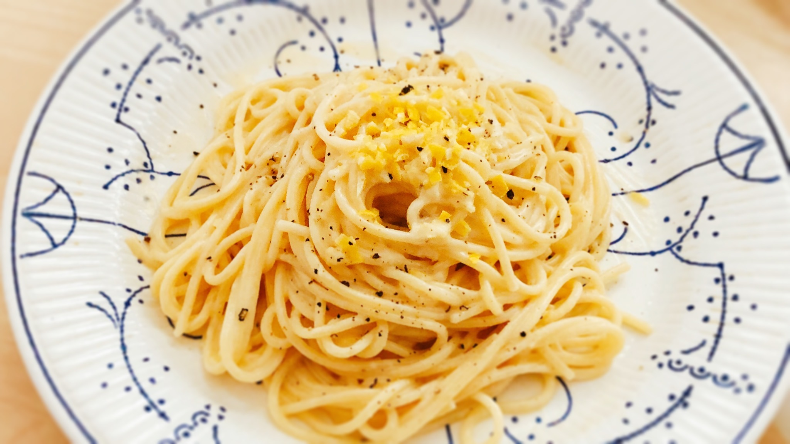

# Pasta al Limone

## ingredients

- lemon `1 piece`
- heavy cream `50ml`
- butter `2 tbsp`
- parmesan `3 tbsp`
- spaghetti `100g`
- salt && pepper

## instructions

### init

- Grate `lemon` zest
- Juice `lemon`

### pasta

- In a pot, heat `heavy cream` and `lemon` zest on medium heat
- Meanwhile, prepare `spaghetti` according to package instructions
- Once `heavy cream` is simmering, turn heat to medium low
- Repeat 2 times:
    - Add in 1 tbsp of cold `butter`
    - Whisk until combined
- When `spaghetti` turn al dente, drain them and place them in sauce along with some pasta water
- Add in 1 tbsp of `lemon` juice
- Repeat 3 times:
    - Add in 1 tbsp of `parmesan`
    - Stir in until combined
- Season with `salt && pepper` to taste

## variants

- Add cayenne pepper or red pepper slices
- Garnish with some extra `lemon` zest strips
