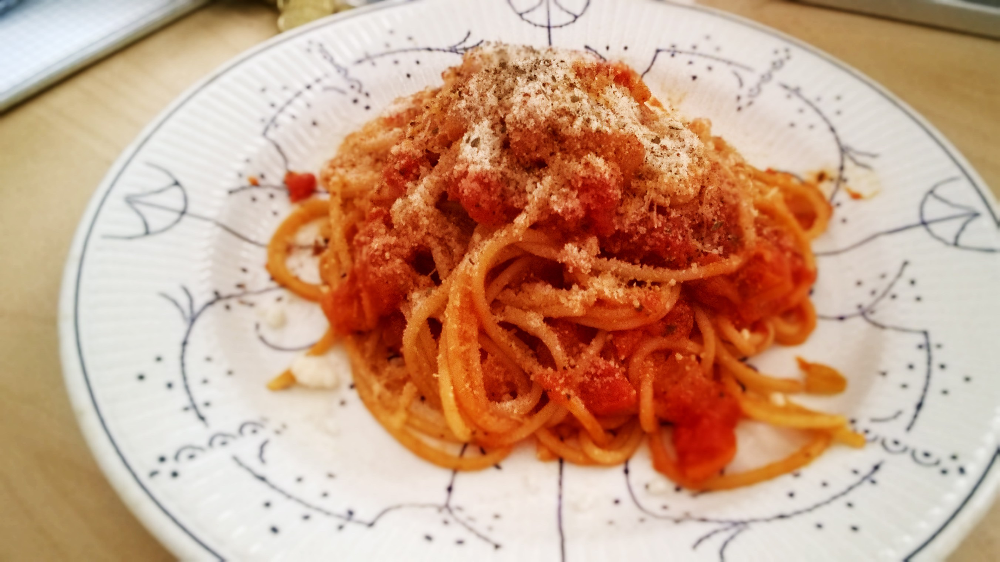

# Pasta all'Arrabbiata

## ingredients

- onion `1 small`
- garlic `1 clove`
- olive oil
- salt && pepper
- cayenne pepper
- diced canned tomatoes `250ml`
- water `100ml`
- basil
- butter `1 tbsp`
- spaghetti `100g`

## instructions

### sauce

- Finely chop `onion` and mince `garlic`
- In a pan, sauté `onion` in some `olive oil` with some `salt` until they soften
- Add in `garlic` and `cayenne pepper` and stir for one minute
- Turn heat to medium low and add in `diced canned tomatoes` and `water`
- Cook for 45 minutes
- Turn heat down

### pasta

- Prepare `spaghetti` according to package instructions
- Wait until 5 minutes before finish
- Let `butter` melt in sauce
- Add `basil`, `salt`, `pepper`, and `cayenne pepper` to sauce to taste
- When `spaghetti` turn al dente, drain them and place them in sauce with some pasta water
- Coat them in sauce thoroughly and serve

## variants

- Instead of `cayenne pepper`, add an appropriate amount of red pepper slices
- Use penne or other pasta variants instead of spaghetti
- Add some grated parmesan to the sauce and let them coat the pasta
- Garnish with `basil` leaves and grated parmesan
