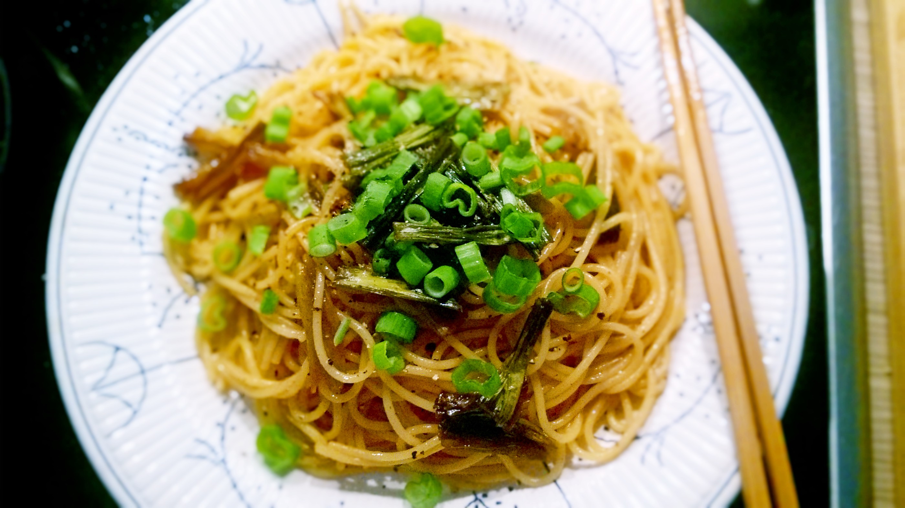

# Scallion Oil Spaghetti

## ingredients

- spaghetti `100g`
- oil
- light soy sauce `2 tbsp`
- sugar `1 tsp`
- scallions

## instructions

### init

- Wash `scallions` and cut them into medium pieces; reserve some of the green parts for garnish
- Dry them thoroughly
- In a pan, on low heat, add oil until the whole pan is covered
- Prepare `spaghetti` according to package instructions
- When finished, rinse with cold water and drain them

### scallion oil

- When oil is hot, add `scallions`
- Fry for 20 minutes or until `scallions` are brown and thoroughly cooked
	- Turn `scallions` every 5 minutes
- Take half of the `scallions` out and drain them on a paper towel

### mix

- Add `light soy sauce` and `sugar` to the scallion oil
- Cook until `light soy sauce` boils
- Add `spaghetti` and mix thoroughly
- Garnish with some fresh `scallions`