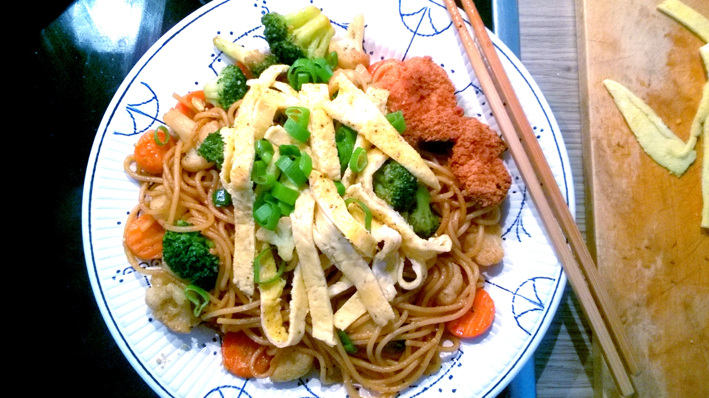

# Stir-Fry Spaghetti

## ingredients

- garlic `1 clove`
- scallion `1 stalk`
- spaghetti `100g`
- bean sprouts
- oil
- curry powder
- light soy sauce `4 tbsp`
- maple syrup `1 tsp` || sugar `1 tsp`
- salt && pepper
- cayenne pepper

## instructions

### init

- Prepare `spaghetti` according to package instructions
- Mince `garlic`
- Chop `scallion` into small pieces and separate into white and green part
- When `spaghetti` is ready, rinse with cold water and drain them

### scallion oil

- Add some `oil` to a pan
- When hot, add the white part of the `scallion`
- Cook until slightly browned and fragrant

### stir-fry

- Add `bean sprouts` to oil
- Season with `salt`
- Cook for several minutes and set aside
- In the oil, stir in `curry powder` and `garlic` until fragrant
- Add `spaghetti` to the pan
- Add `light soy sauce` and stir thoroughly to coat `spaghetti` evenly
- Fry `spaghetti` on multiple sides for a couple of minutes
- Season with `light soy sauce`, `pepper`, and `cayenne pepper` to taste

### garnish

- Serve `stir-fry` on a plate with `bean sprouts`
- Garnish with the rest of the `scallion`

## variants

- Add a deep fried cutlet at the end, cut into strips
- Add a fried egg
- Add hot oil or red chili flakes
