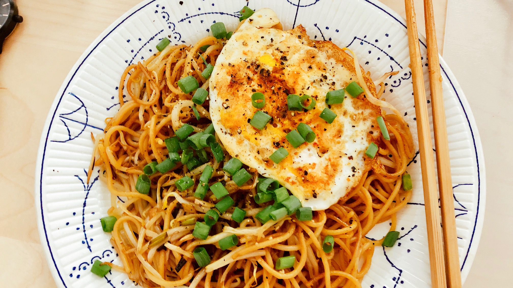

# Stir-Fry Spaghetti

## ingredients

- salt & pepper
- cayenne pepper
- eggs `1 piece`
- light soy sauce
- hoisin sauce || sugar *(optional)*
- vegetable oil
- bacon `3 strips` *(optional)*
- garlic `1 clove`
- scallion `1 stem`
- bean sprouts
- spaghetti `100g`

## instructions

### init

- Mince `garlic`
- Chop `scallion` into small pieces and separate into white and green part
- Cut `bacon` strips into even, medium pieces

### sauce

- If you have `hoisin sauce` available:
	- Mix 3 tablespoons of `light soy sauce` and 1 tablespoon of `hoisin sauce` in a cup
- Else:
	- Mix 4 tablespoons of `light soy sauce` and, optionally, 0.5 tablespoons of `sugar` in a cup

### omelette

- Crack `egg` into a mixing bowl and scramble with some `salt & pepper`
- Heat some `vegetable oil` in a pan on medium heat
- Once warm, add eggs and move the pan around to spread them out
- When the eggs firm up, use a spatula to ease around the edges and flip
- Cook for another half minute then slide the omelette onto a plate

### spaghetti

- Prepare `spaghetti` according to package instructions
- When finished, rinse with cold water and drain them

### stir-fry

- If `bacon` is available:
	- In the pan, stir-fry `bacon` until they become soft and lightly browned
- Add some `vegetable oil` and the white part of the `scallion`
- Stir in `garlic` until they become slightly golden
- Stir in `bean sprouts` and cook until tender
- Move the `bacon` and vegetables to the edge of the pan
- Add some more `vegetable oil` and the cooked `spaghetti` to the center of the pan
- Pour `sauce` on everything and stir thoroughly to coat `spaghetti` with `sauce` and `vegetable oil` evenly
- Fry `spaghetti` on multiple sides for a couple of minutes
- Season with `light soy sauce`, `pepper`, and `cayenne pepper` to taste

### garnish

- Serve `stir-fry` on a plate
- Cut `omelette` into strips
- Garnish with `omelette` strips and the rest of the `scallion`

## variants

- Add more or substitute `bean sprouts` with vegetables like broccoli, cauliflower, carrots, or onions
- Add a deep fried cutlet at the end, cut into strips
