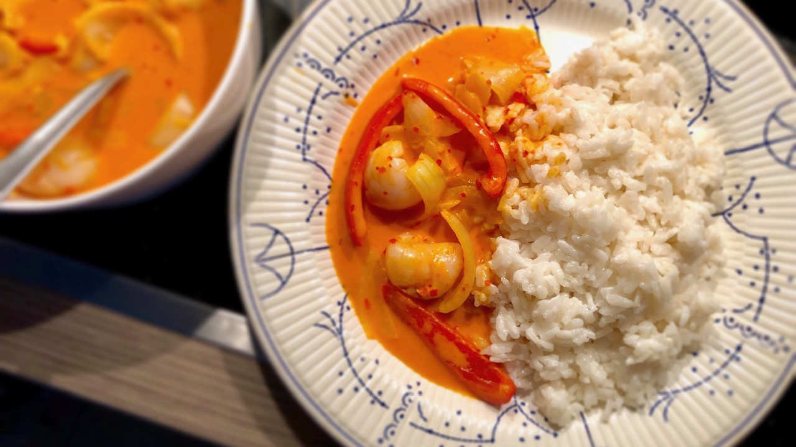

# Thai Red Litchi Curry

## ingredients

- onion `1 piece`
- red bell pepper `1 piece`
- rice `1/3 cup`
- coconut milk `1/3 cup + 1/2 cup`
- water
- sugar `1 tbsp`
- oil
- Thai red curry paste `2 tsp`
- tomato paste `1 tbsp`
- light soy sauce `1 tbsp`
- peanut butter `2 tsp`
- canned litchi

## instructions

### init

- Chop `red bell pepper` into strips
- Chop `onion` into petals

### coconut rice

- Thoroughly rinse `rice`
- Add `rice`, 1/4 cup of `coconut milk`, and 1/4 cup of `water` to a pot
- Add `sugar` and a pinch of `salt`
- On high heat bring the water to a boil
- Turn heat to low and cover the pot
- Wait 15 minutes
- Turn heat off and wait another 10 minutes

### curry

- On medium heat, add 1/4 cup of `coconut milk` to a pan
- Reduce until thick and the coconut oil starts separating
- Stir in `Thai red curry paste`
- Stir in `tomato paste`
- Add 1/3 cup of `coconut milk` and 1/3 cup of `water` as needed
- Add `light soy sauce`, `onion`, and `red bell pepper`
- Simmer for 15 minutes
- Stir in `peanut butter`
- Add some `canned litchi` and litchi syrup to taste
- Heat through the litchi and serve
