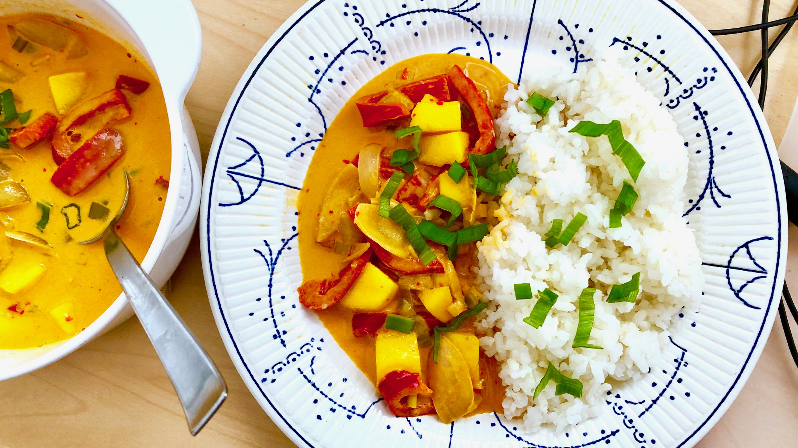

# Thai Red Mango Curry

## ingredients

- onion `1 piece`
- red bell pepper `1 piece`
- rice `1/3 cup`
- coconut milk `1/3 cup + 1/2 cup`
- water
- sugar
- thai red curry paste `2 tsp`
- tomato paste `1 tbsp`
- light soy sauce `2 tbsp`
- peanut butter `1 tsp`
- mango `1 cheek`

## instructions

### init

- Chop `red bell pepper` into strips
- Chop `onion` into petals
- Slice `mango` cheek into cubes

### coconut rice

- Thoroughly rinse `rice`
- Add `rice`, 1/4 cup of `coconut milk`, and 1/4 cup of `water` to a pot
- Add 1 tbsp of `sugar` and a pinch of `salt`
- On high heat bring the water to a boil
- Turn heat to low and cover the pot
- Simmer for 15 minutes
- Turn heat off and wait another 10 minutes

### curry

- On medium heat, add 1/4 cup of `coconut milk` to a pan
- Reduce until thick and the coconut oil starts separating
- Stir in `thai red curry paste`
- Stir in `tomato paste`
- Add 1/3 cup of `coconut milk` and 1/3 cup of `water`
- Add `onion`, and `red bell pepper`
- Season with `light soy sauce` to taste and 1 tbsp of `sugar`
- Simmer for 15 minutes
- Stir in `peanut butter`
- Add `mango` cubes
- Heat through the `mango` and serve

## variants

- Garnish with coconut shreds and scallion
