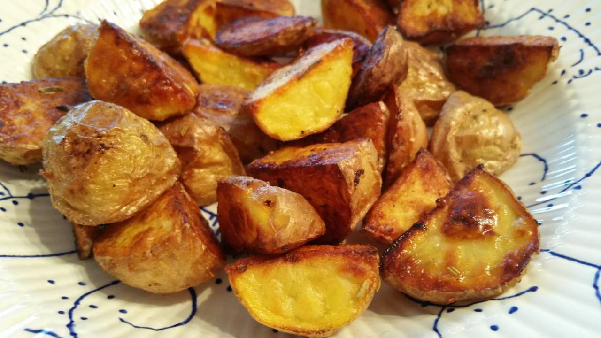

# Cottage Fries

## ingredients

- potatoes
- olive oil
- salt & pepper
- garlic powder *(optional)*
- paprika powder *(optional)*
- dried rosemary *(optional)*
- dried thyme *(optional)*
- dried oregano *(optional)*
- dried basil *(optional)*
- lemon juice *(optional)*

## instructions

### init

- Preheat oven to 220°C
- Wash `potatoes` thoroughly
- Cut `potatoes` into chunks 
- Transfer `potatoes` into a bowl of cold water
- Rinse `potatoes` until water turns murky
- Drain and dry `potatoes` and put them into a bowl

### seasoning

- Generously coat `potatoes` with `olive oil`
- Generously season with `salt` and `pepper`
- For each `herb` you have in [`garlic powder`, `paprika powder`, `dried rosemary`, `dried thyme`, `dried oregano`, `dried basil`]:
  - Season `potatoes` with `herb` to taste
- Mix thoroughly

### baking

- Spread `potatoes` evenly onto a baking sheet
- Repeat two times:
  - Bake for 15 minutes
  - Remove `potatoes` from oven, flip them, and put them back in

### garnish

- Transfer `potatoes` on a serving dish
- Squeeze some `lemon juice` on top if you have some
- Add more `salt` and `pepper`